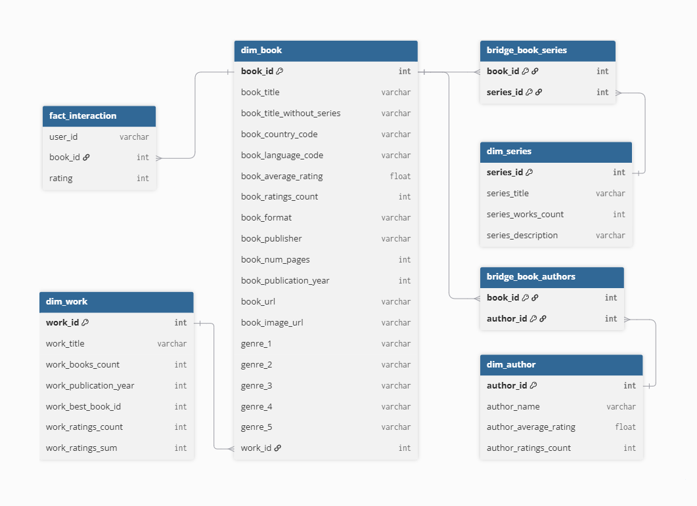
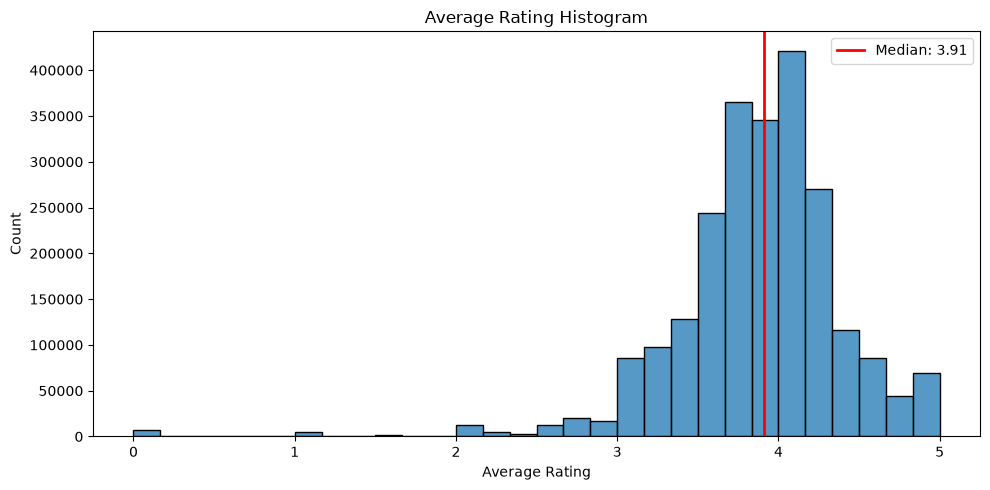
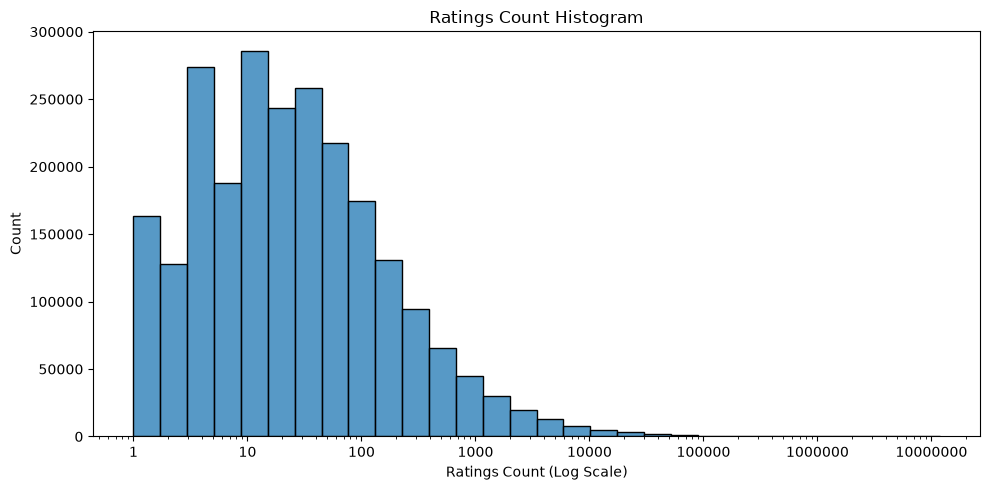
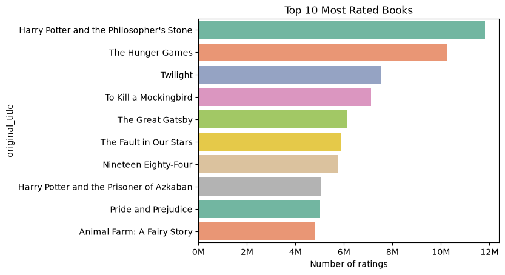
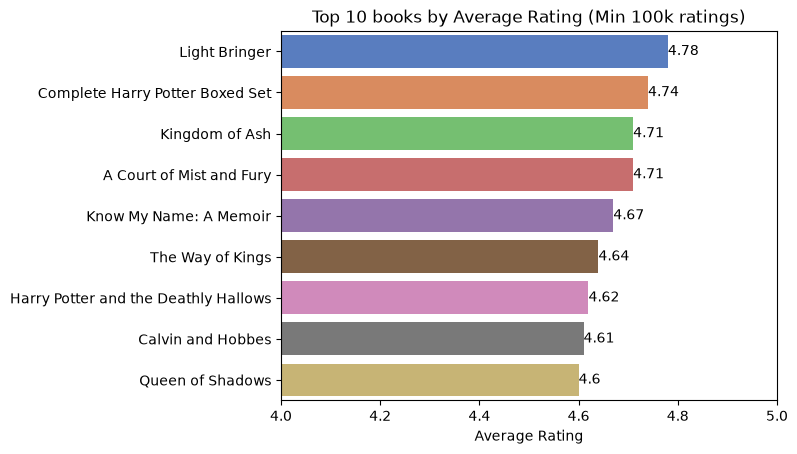
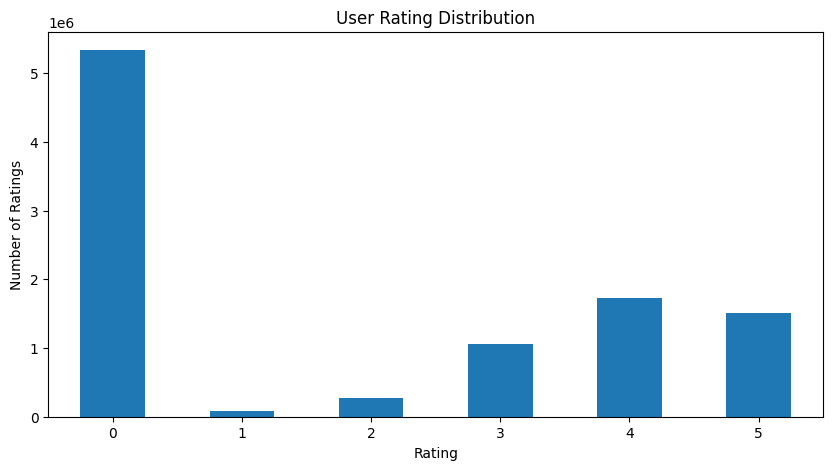
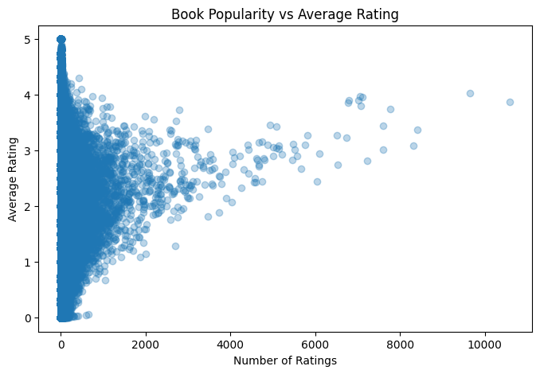
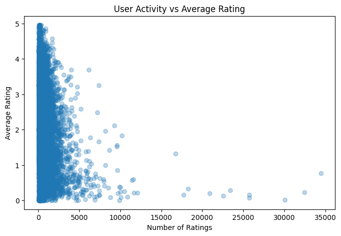
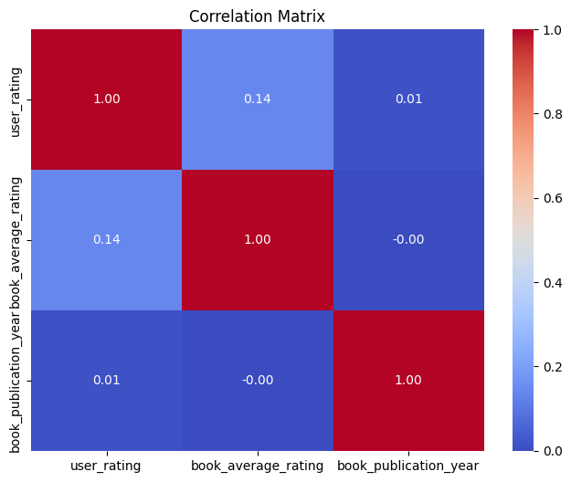

# Goodreads Data Project

### Book Rating and Reader Preference Analysis Using the Goodreads Dataset

---

## 1. Overview

This project looks at **book ratings and reader preferences** using large-scale Goodreads data.

It currently covers three stages: **Data Engineering**, building a **Data Warehouse**, and **Exploratory Data Analysis (EDA)**.

The goal is to turn a set of fairly messy, heterogeneous Goodreads sources into a structured warehouse and a few analytical data marts, then use those to look for patterns in ratings, book popularity, and reader behavior.

Down the line, these results are meant to feed into a **Book Recommendation System** (that part hasn't been built yet).

> **Current scope:** Data Engineering → Data Warehouse → EDA

> **Next up:** Book Recommendation System

---

## 2. Problem Statement

An average rating alone doesn't tell you much about how popular or how reliable a book's score actually is.

Two books can both sit at 4.5 stars, yet one has thousands of ratings and the other only a few dozen — same score, very different amount of evidence behind it.

Readers also differ a lot in what they like — genre, author, series, language, publication era, or just how generously they rate. So the question this project tries to answer is:

> **What patterns show up in Goodreads ratings, book popularity, and reader preferences?**

Part of that is looking at how the number of ratings a book has relates to how stable its average rating is — useful context before trusting a high score that's only based on a handful of reviews.

---

## 3. Dataset

The project combines two sources.

### 3.1 UCSD Goodreads Dataset

The main source is the **UCSD Goodreads Dataset** from UC San Diego, which includes book metadata, authors, works, series, genres, users, user–book interactions, and ratings/reviews. The original data was collected up to late **2017**.

Source: https://cseweb.ucsd.edu/~jmcauley/datasets/goodreads.html

### 3.2 Additional Scraped Data

Since the UCSD dataset is an older snapshot, we also scrape more recent Goodreads data with **[Apify](https://apify.com/epctex/goodreads-scraper)** — book ID, title, author, rating, rating count, format, page count, publication date, publisher, language, series, Goodreads URL, and cover image.

This scraped data is used to add new books, refresh rating info on books already in the warehouse, and fill in gaps left by the older UCSD snapshot. The scraping and update process is still being folded into one unified pipeline.

### 3.3 Dataset Scale

Combining both sources, the project currently works with approximately:

| Data | Amount |
|---|---:|
| Books | ~2.36 million |
| Authors | ~830,000 |
| Original user–book interactions | ~228.6 million |

---

## 4. Data Engineering Pipeline

```
01_create_dw.sql
 └── 02_load_dw.sql     <--- [UCSD Datasets]
      └── 02_load_dw_scrapped.sql       <--- [Scrapped Data]
           └── 03_create_dm.sql
                └── EDA
```

**Extract** — raw data comes from UCSD's `.json.gz` files plus the Apify-scraped Goodreads data.

**Transform** — standardize fields, handle missing values, drop duplicate book records, map relationships between books, works, authors and series, prepare rating/interaction data, and merge scraped info into what's already in the warehouse.

**Load** — write the transformed data into a **DuckDB-based Data Warehouse**.



---

## 5. Analytical Data Marts

Two marts sit on top of the warehouse for EDA:

- **`mart_book_statistics`** — book-level info (authors, series, genres, ratings, rating counts, publication info, page counts), used for book-level EDA.
- **`mart_user_ratings`** — user rating info joined with book attributes, used to look at rating behavior, rating distributions, user activity, and how individual ratings relate to a book's overall rating.

---

## 6. Data Preprocessing

Because the data comes from multiple sources, it has its share of missing or inconsistent values. Main steps: dedupe scraped book records, standardize column names and types, map languages to standard codes, handle missing values depending on the analysis, check book–work relationships, merge in scraped rating info, and filter out values that don't fit a given analysis.

We don't blanket-drop every row with a missing value — a missing `num_pages`, for instance, doesn't stop a book from being used in a rating or popularity analysis. For user-rating analysis specifically, ratings of `0` are treated separately since they aren't real 1–5 star ratings, so anything looking at actual rating behavior only uses the **1–5** scale.

---

## 7. Exploratory Data Analysis

We perform EDA at two levels: book-level and user-level, focusing on rating patterns, popularity, and reader behavior.

### 📚 Book-level EDA
We analyze how book ratings are distributed, how popularity varies across books, and how rating stability changes with the number of ratings.

<p align="center">
  
  
</p>

<p align="center">
  
  
</p>

Key observations:
- Ratings are generally concentrated around 4 stars.
- Most books receive relatively few ratings, while a small number are extremely popular.
- Average ratings become more stable as the number of ratings increases.
- 90% of books have ≤ 294 ratings, while the top 1% have > 4,609.

### 👤 User-level EDA
We examine user rating behavior, user activity, and the relationship between individual ratings and overall book ratings.

<p align="center">
  
  
</p>

<p align="center">
  
  
</p>

Key observations:
- Most explicit user ratings are concentrated around 4–5 stars.
- User activity is concentrated among users with 10–1,000 ratings.
- Individual user ratings have only a weak correlation with overall book ratings (r ≈ 0.14).
- Publication year shows almost no linear relationship with ratings.
- Books with fewer ratings show greater variation in their average ratings, while ratings become more stable as the number of ratings increases.


---

## Tech Stack

| Technology | Purpose |
|---|---|
| Python | Data processing, scraping, EDA |
| SQL | Transformations, warehouse queries |
| DuckDB | Data Warehouse |
| Pandas | Analysis and data wrangling |
| Matplotlib / Seaborn | EDA visualizations |
| Apify | Goodreads scraping |
| Parquet | Analytical data storage |
| Git / GitHub | Version control, collaboration |


---

## Future Work

Right now the focus is on understanding and preparing the data. Next up is building a **Book Recommendation System** on top of the warehouse and EDA work already done.

Possible directions: rating-based recommendations, user preference modeling, book similarity, genre/author preferences, deeper user–book interaction analysis, popularity-aware recommendations, and evaluating recommendation quality.

The recommendation system itself **isn't built yet** — it's the planned final stage.

---

## References

- **UCSD Goodreads Dataset:** https://cseweb.ucsd.edu/~jmcauley/datasets/goodreads.html
- **Goodreads:** https://www.goodreads.com/
- **Apify:** https://apify.com/
